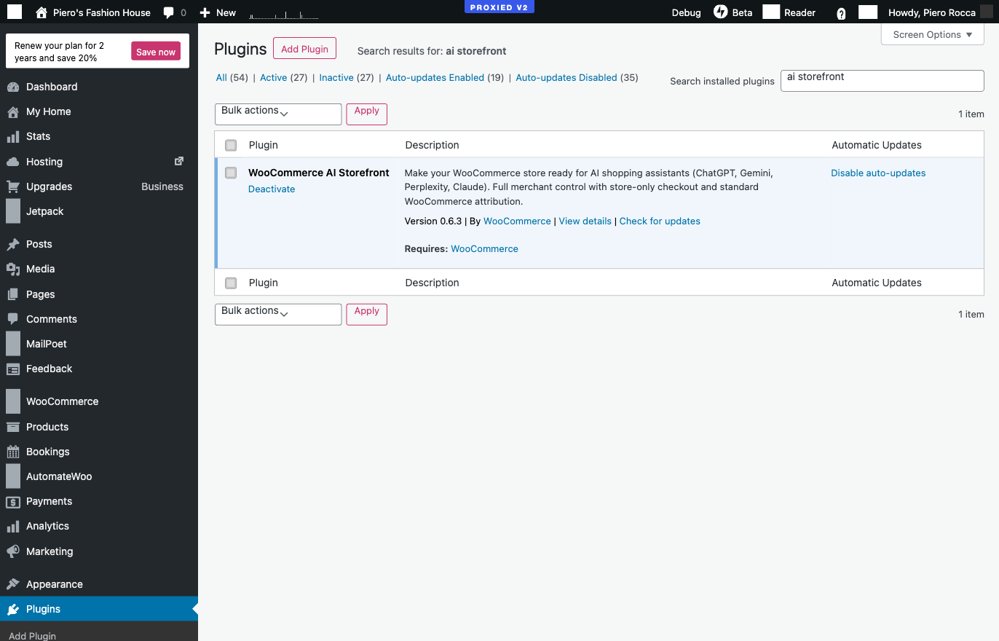
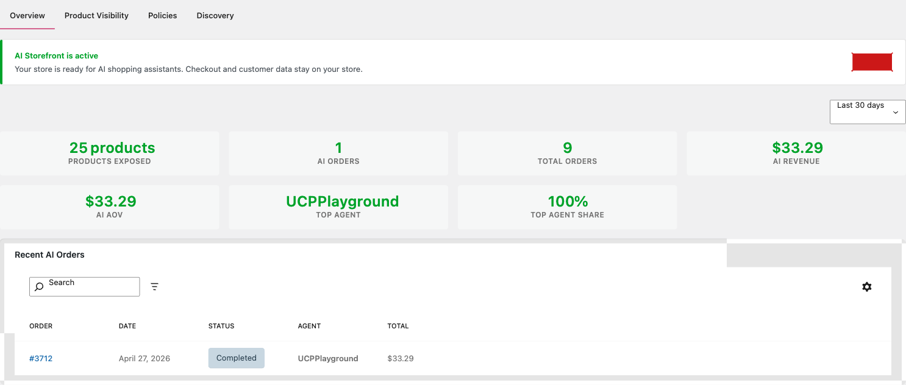
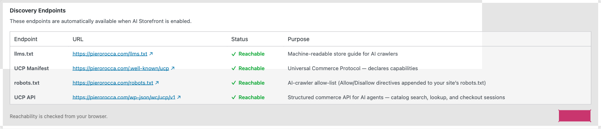
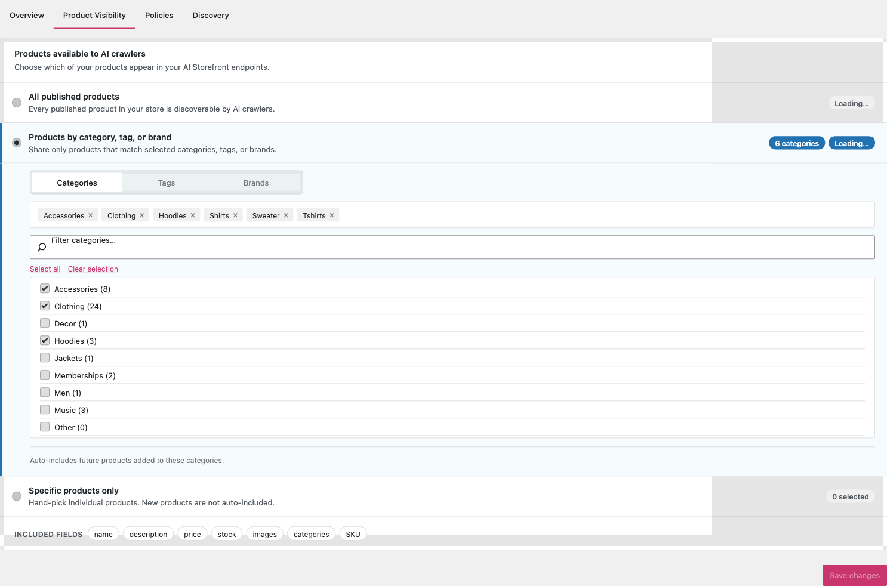
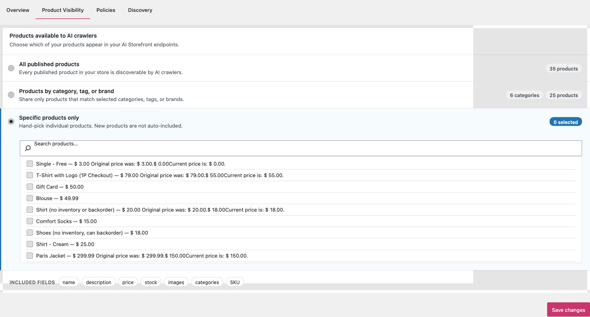
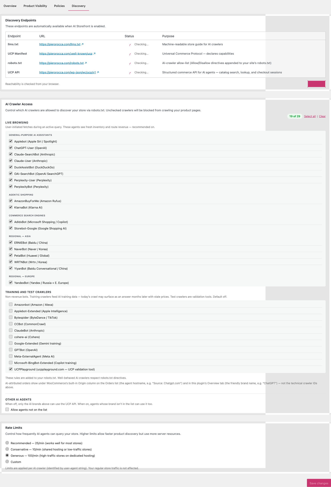
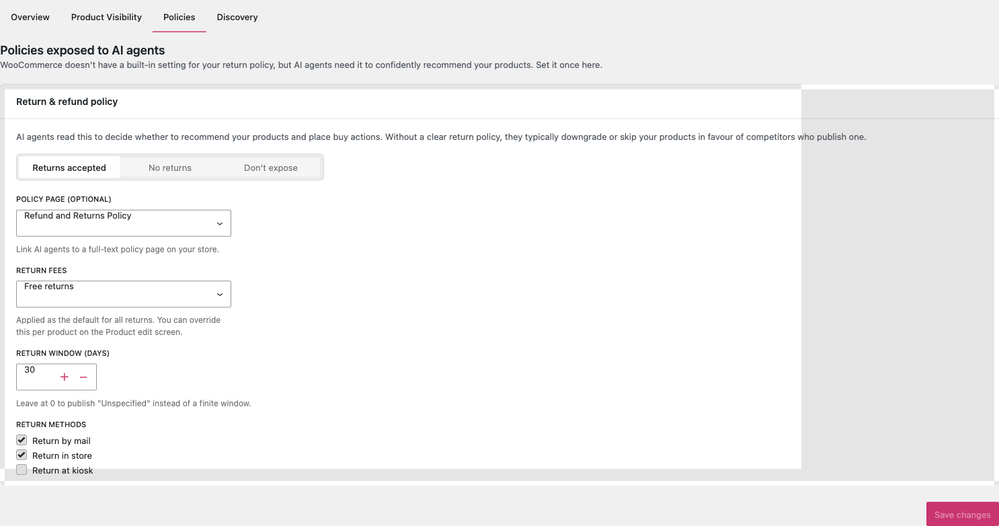
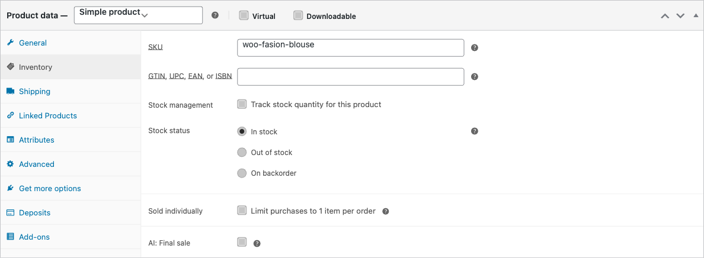
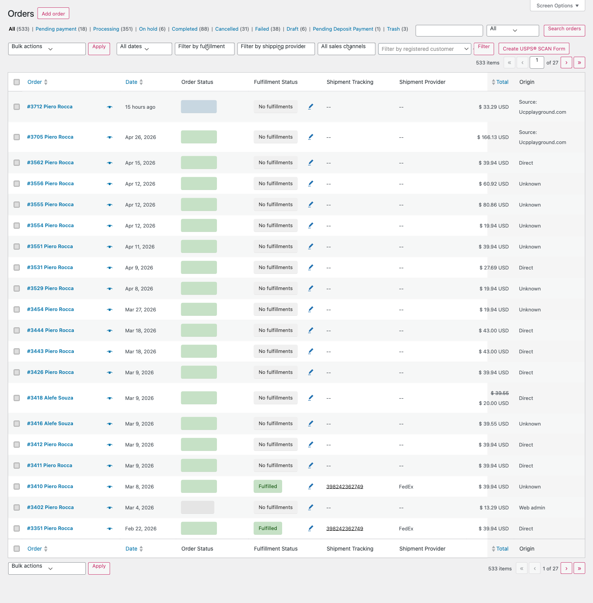
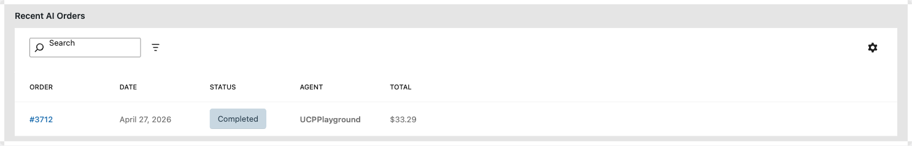

# WooCommerce AI Storefront: Merchant User Guide

A step-by-step guide for store owners. Make your catalog discoverable to AI shopping assistants (ChatGPT, Gemini, Claude, Perplexity, Copilot) without giving up checkout, customer data, or your payment processor.

> Reading time: about 10 minutes. Following along: about 10 minutes plus optional verification.

## Contents

1. [Before you start](#1-before-you-start)
2. [Install and activate](#2-install-and-activate)
3. [Enable AI Storefront](#3-enable-ai-storefront)
4. [Verify your discovery endpoints](#4-verify-your-discovery-endpoints)
5. [Choose which products to expose](#5-choose-which-products-to-expose)
6. [Configure crawlers and rate limits](#6-configure-crawlers-and-rate-limits)
7. [Set your return policy](#7-set-your-return-policy)
8. [Read attribution stats](#8-read-attribution-stats)
9. [Maintenance and monitoring](#9-maintenance-and-monitoring)
10. [Troubleshooting](#10-troubleshooting)
11. [Where to get help](#11-where-to-get-help)

---

## 1. Before you start

You'll need:

- WordPress 6.7+, WooCommerce 9.9+, PHP 8.1+ (your host controls PHP; most modern hosts already meet this).
- An admin or Shop Manager account (anything with `manage_woocommerce`).
- A site reachable on the public internet. AI agents won't see a store behind a staging password or "coming soon" plugin.

You **don't** need an AI account, an API key, or a developer.

---

## 2. Install and activate

1. **Plugins → Add New → Upload Plugin**.
2. Select `woocommerce-ai-storefront.zip` and click **Install Now**.
3. Click **Activate**.

A new menu item appears under **WooCommerce → AI Storefront**. If you don't see it, confirm WooCommerce itself is active. AI Storefront depends on it.

---

## 3. Enable AI Storefront

The plugin installs in **paused** mode. Nothing publishes until you turn it on.

1. Go to **WooCommerce → AI Storefront**. You'll land on the **Overview** tab.
2. Click **Enable AI Storefront** at the top of the page.

Enabling does five things:

- Adds AI-crawler `Allow:` directives to `robots.txt`.
- Publishes the Markdown store guide at `/llms.txt`.
- Publishes the JSON manifest at `/.well-known/ucp`.
- Enables enhanced JSON-LD on product pages.
- Starts capturing AI-attributed orders into WooCommerce Order Attribution.

To pause, click **Disable** in the same banner. Discovery endpoints return 404, JSON-LD additions are removed, `robots.txt` reverts to the WordPress default. Captured order attribution stays in place.

The Overview tab populates with stat cards once data flows in:

- **Products exposed**: products AI agents can currently see (matches your visibility settings).
- **AI orders / Total orders**: AI-attributed volume against the period total.
- **AI revenue / AI AOV**: gross revenue and average order value from AI-referred orders.
- **Top agent / Top agent share**: which agent drives the most volume, and what share of AI revenue it represents.

> Stats are blank on day one. First AI traffic typically lands within a few days; meaningful aggregate volume takes weeks.

---

## 4. Verify your discovery endpoints

Before configuring anything else, take 30 seconds to confirm the endpoints are live.

| URL | What you should see |
|-----|---------------------|
| `https://your-store.com/llms.txt` | A plain-text Markdown document starting with `# Your Store Name`, with a category list and "How AI agents should link to products" section. |
| `https://your-store.com/.well-known/ucp` | A pretty-printed JSON document. Top-level keys: `name`, `version`, `capabilities`, `payment_handlers`, `services`. |
| `https://your-store.com/robots.txt` | The standard WordPress `robots.txt` plus a block of `User-agent: GPTBot` / `User-agent: ChatGPT-User` / etc. each with `Allow:` lines. |
| Any product page → "View page source" | Search for `"@type":"Product"`. Look for a `BuyAction` block, an `offers` array with prices, and (once you set one in [section 7](#7-set-your-return-policy)) `hasMerchantReturnPolicy`. |

The Discovery tab shows the same URLs as clickable links with reachability dots:

If something returns 404 or shows your homepage, jump to [Troubleshooting](#10-troubleshooting).

**Smoke test with an AI assistant.** Once endpoints check out, ask one of the major assistants with live web browsing:

> *"Find products at \[your-store.com\] that match \[some attribute, e.g. 'red running shoes under $100'\]."*

A working setup returns real product names with prices and links to your store within 3–10 seconds. If the agent says it can't find anything, wait a few hours (most agents cache crawl results) and retry.

---

## 5. Choose which products to expose

The **Product Visibility** tab controls what AI agents can see. Three modes:

| Mode | What AI agents see | Use when |
|------|--------------------|----------|
| **All published products** | Everything currently published | Default. Use unless you have a reason to scope. |
| **Products by category, tag, or brand** | Only products in the selected taxonomies | You want to expose evergreen lines but exclude clearance, NSFW, or out-of-region products. |
| **Specific products only** | Only products you pick individually | Curated launches, B2B-restricted SKUs, limited drops. |

**Steps:**

1. Open the **Product Visibility** tab.
2. Pick the mode.
3. For **Products by category, tag, or brand**, switch between the **Categories**, **Tags**, and **Brands** sub-tabs and check what you want included. The product-count pill updates live.
4. For **Specific products only**, search by name or SKU and click each product to add it.
5. Click **Save changes** at the bottom-right.

Visibility applies consistently across `/llms.txt`, the UCP catalog endpoints, and JSON-LD on product pages. Excluded products cannot be returned by an AI agent's catalog query; exclusion is enforced at the data layer, not by hiding links.

> **Note.** Visibility settings only affect AI-agent-facing surfaces. The Shop page, search, and category archives keep working exactly as before for regular shoppers.

---

## 6. Configure crawlers and rate limits

The **Discovery** tab controls which AI crawlers can read your endpoints and how aggressively.

### Crawlers

The list groups 18+ AI bots into three buckets:

- **Live browsing agents**: fetch pages in real time when a user asks. Default: **on**. These drive shopping clicks.
- **Training crawlers**: feed AI providers' training corpora. Default: **on**. Letting your catalog inform model updates is generally good for long-tail product discovery.
- **Test/validation crawlers**: for protocol-compliance tools like UCPPlayground. Default: **off**.

Unchecking adds a `Disallow:` directive for that user-agent. This is a cooperative protocol; well-behaved crawlers respect it; malicious bots ignore robots.txt entirely (and don't make purchase recommendations either).

### Rate limit

Controls requests per minute the Store API accepts from each AI crawler before serving HTTP 429.

- **Default:** 25 RPM per crawler. Balanced for catalogs of any size.
- **Lower** (down to 1 RPM) if you've seen spikes on a small hosting plan.
- **Raise** (up to 1000 RPM) if you have 10,000+ products and notice agents pagination-stalling.

Rate limiting only affects AI crawlers (matched by user-agent). Regular customers, your storefront, and admin REST traffic are unaffected.

### Revisit cadence

- **Quarterly.** New AI crawlers come online; check the list. Plugin updates sync the canonical roster; stale opt-outs stay opt-out.
- **After traffic spikes.** Lower the rate limit before you remove crawlers. Most spikes are first-time discovery; rates settle within a week.

---

## 7. Set your return policy

AI agents that surface your products often try to display return windows inline ("Free returns for 30 days"). The **Policies** tab publishes a structured policy agents can read.

Three modes:

- **Not configured** *(default)*. No JSON-LD return policy is published. Use when your policy is too complex to summarize and you'd rather link to a dedicated returns page.
- **Returns accepted.** Specify window in days, who pays return fees, accepted return methods. Emits as Schema.org `MerchantReturnPolicy`.
- **Final sale.** Declares no returns. Same Schema.org markup, with the appropriate flag.

You can also link to an existing returns/refunds page from the dropdown. This is useful when the policy already lives on a customer-facing page.

### Per-product overrides

Some merchants have a generally returnable catalog with specific final-sale items (clearance, custom, perishable). The **AI: Final sale** checkbox in the product editor's Inventory tab overrides the store-wide policy for that single product.

---

## 8. Read attribution stats

When a shopper completes a purchase via an AI-agent link, WooCommerce captures three things on the order:

- The agent's hostname (e.g. `chatgpt.com`), stored as `utm_source`.
- `utm_medium=referral` and `utm_id=woo_ucp`: the signals AI Storefront uses to identify the order as AI-referred.
- A session correlation ID (`ai_session_id`): useful for debugging; not personally identifying.

### Where to see it

**WooCommerce Orders list.** Open **WooCommerce → Orders**. The built-in **Origin** column shows the agent hostname (`Source: Chatgpt.com`, `Source: Gemini.google.com`, `Source: Ucpplayground.com`) for AI-referred orders. Non-AI orders show `Direct`, `Unknown`, or the standard referring source.

**Overview tab.** The stat cards aggregate AI orders, revenue, AOV, and top-agent share for the selected period.

**Recent AI Orders table** (Overview tab). The most recent AI-attributed orders with order number, date, status, agent, and total. Clicking the order number opens the WC order edit screen. Search and column-filter controls included.

### What attribution doesn't capture

The plugin does not record:

- Shopper identity beyond what WooCommerce already captures at checkout (name, email).
- The shopper's conversation with the AI agent.
- Cross-device or cross-session journey data.

For multi-touch journey attribution, pair this plugin with an analytics tool that reads WooCommerce's order-attribution meta. That's the supported integration point.

---

## 9. Maintenance and monitoring

Day-to-day maintenance is minimal.

**Weekly (5 min).** Glance at the Overview tab. Sudden drops in AI orders usually mean an agent revised its crawl policy or `robots.txt` changed. If one agent dominates, dig into how that agent surfaces your products.

**Monthly (10 min).** Re-verify the four endpoint URLs from [section 4](#4-verify-your-discovery-endpoints). Hosting, CDN, and security plugin changes can break virtual URLs. Review your visibility scope.

**After major changes.** Re-verify endpoints after a WordPress core update, a WooCommerce major version update, switching themes, installing or updating a security plugin (some block `/.well-known/` by default; allow-list `/.well-known/ucp` if so), or migrating hosts.

**Plugin updates.** AI Storefront ships frequent updates while the protocol is evolving. Each release has a CHANGELOG entry; review before updating in production. 0.x.y updates are backwards-compatible; a major version bump (e.g. 0.x → 1.0) will be called out explicitly with migration notes.

---

## 10. Troubleshooting

### `/llms.txt` returns 404

Permalinks need flushing. Go to **Settings → Permalinks**, click **Save Changes** without changing anything, reload `/llms.txt`. If still 404, check the plugin is enabled. Paused means 404 by design.

### `/.well-known/ucp` returns 404 but `/llms.txt` works

A security or hardening plugin is blocking `/.well-known/`. Allow-list `/.well-known/ucp` in its rules.

### JSON-LD doesn't include the BuyAction

A theme or page-builder is overriding WooCommerce's `wp_head` hooks. Switch to Storefront temporarily to confirm; then either contact the theme developer or pick a theme that respects WC's structured-data hooks.

### AI agents say they can't find your store

Most likely the store has been live for less than 24 hours, or `robots.txt` blocks the agent's user-agent, or your `WordPress Address (URL)` in **Settings → General** doesn't match the public hostname. Wait 24–48 hours; check the Discovery tab; confirm the URLs match; visit `/llms.txt` from a fresh browser session.

### Stats are zero after a week

Confirm "Products exposed" > 0 on the Overview tab, at least one live-browsing crawler is checked on the Discovery tab, and the four endpoints from section 4 verify. Discovery is asynchronous; consumer-facing AI traffic is the lagging signal.

### Orders show up as AI-attributed when they shouldn't

A team member tested with a real AI assistant and clicked through. The attribution is correct: that order really was AI-referred. Use a dedicated test account or staff discounts when smoke-testing.

### `robots.txt` looks empty after disabling

Correct behavior. The plugin removes its own block; what remains is WordPress's default (`User-agent: *` + `Disallow: /wp-admin/`).

---

## 11. Where to get help

- **Documentation index:** [`docs/README.md`](../README.md)
- **Engineering docs** (for developers extending or debugging): [`docs/engineering/`](../engineering/)
- **Bug reports & feature requests:** open an issue on GitHub.
- **Security issues:** see [`SECURITY.md`](../../SECURITY.md). **Do not** open a public issue for security reports.
- **General WooCommerce support:** [woocommerce.com/support](https://woocommerce.com/support/) for questions about checkout, payments, taxes, shipping, or anything else WooCommerce-core-shaped.

---

*Covers AI Storefront 0.6.x. Screenshots taken from a stock WordPress 6.7 + WooCommerce 9.9 install. Your store may look slightly different depending on theme and admin color scheme.*
