# WooCommerce AI Storefront: Merchant User Guide

A step-by-step guide for store owners. Make your catalog discoverable to AI shopping assistants and AI search engines (ChatGPT, Gemini, Claude, Perplexity, Copilot, Google AI Overviews) without giving up checkout, customer data, or your payment processor.

> **Status: Beta.** The plugin is in active development. Features and shape may change between releases. Production use is supported; your feedback shapes what ships in 1.0.

> Plan for 15 minutes. You'll have AI Storefront installed, configured, and verified live by the end.

## What this plugin does

AI tools are changing how shoppers find products. Some assistants help a shopper browse, compare, and check out with the shopper present, handing them off to the merchant's checkout when they're ready to buy. Some can also act on a shopper's behalf. Some AI search engines (Google AI Overviews, Perplexity, ChatGPT search) answer product questions by citing real stores. Some chat tools just need a quick orientation to talk about your business accurately. To be visible to all of these, your store needs to publish information in the formats AI tools read.

This plugin makes your store speak three of those formats at the same time, all automatic once you turn it on:

1. **A structured product feed and checkout handoff for AI shopping assistants.** AI assistants, whether they're co-shopping with the buyer in chat or acting on the buyer's behalf, can browse your catalog, check inventory and prices, and send the buyer straight to your checkout with the right items in cart. The assistant handles the shopping conversation; your WooCommerce store handles the transaction. This piece uses a protocol called UCP (Universal Commerce Protocol).

2. **Enhanced structured data on every product page for AI search engines.** Search engines and AI answer engines look for machine-readable details on product pages: price, availability, shipping windows, return policy. The plugin adds these in the modern JSON-LD format (the same standard Google uses for rich snippets, extended for AI). This is the heart of "GEO" (Generative Engine Optimization): showing up accurately when an AI engine answers a shopper's question about products like yours.

3. **A plain-language store summary at `/llms.txt`.** Any AI tool that wants quick context on your business can read this short text guide. It describes what you sell, your categories, and how to link to products. Think of it as a `robots.txt` for the AI era.

You can think of these as three doors into the same store: agents that close the sale walk through door 1, search engines that cite you walk through door 2, conversational tools that talk about you walk through door 3. You don't need to choose; the plugin opens all three.

You do not need an AI account, an API key, or a developer.

## What this plugin does not do

A few things this plugin is intentionally not, so you can decide if it fits your goal:

- **It is not a product feed for Google Shopping, Bing Shopping, Microsoft/Copilot Commerce, or Meta Catalog.** Those platforms ingest catalogs you submit through their merchant centers (Google Merchant Center, Bing Webmaster, Meta Commerce Manager). This plugin works the opposite way: it publishes open discovery surfaces on your own site that AI agents read directly. The two are complementary and stacked: GMC feeds the retrieval layer (which products Google's AI surfaces consider), this plugin feeds the checkout-handoff layer (how AI agents send the shopper through to your store). Keep GMC if you have it; this plugin adds the layer GMC doesn't address. See §1.2 below.

- **It is not for in-chat agentic checkout** (sometimes called "delegated payments" or ACP-style flows). Protocols like Stripe ACP or Google's emerging Agentic Commerce APIs hand the agent a payment token and have it complete the transaction inside the chat surface, sometimes without the shopper present. UCP, what this plugin speaks, explicitly does the opposite: the agent hands the shopper off to your checkout, where the shopper (or, in the on-behalf-of case, the agent acting under their authorization) completes the purchase using your existing payment provider. If your business model requires headless agent purchasing without a shopper-checkout step, this plugin alone won't deliver that.

- **It is not an AI chatbot for your store.** There's no chat widget, no conversational UI, no "ask our store assistant" surface added to your site. The plugin makes your catalog legible to external AI tools (ChatGPT, Gemini, Claude, etc.); it doesn't bring an AI tool into your store.

- **It does not write or improve product copy.** No descriptions are generated, rewritten, or summarized. The plugin reads what you've already authored in WooCommerce and republishes it in machine-readable formats. Better-authored products yield better AI responses, but that's an upstream merchandising task, not something the plugin does for you.

## Contents

1. [Before you start](#1-before-you-start)
2. [Install and activate](#2-install-and-activate)
3. [Enable AI Storefront](#3-enable-ai-storefront)
4. [Verify your discovery endpoints](#4-verify-your-discovery-endpoints)
5. [Choose which products to expose](#5-choose-which-products-to-expose)
5b. [Shape your catalog for AI discoverability](#5b-shape-your-catalog-for-ai-discoverability)
6. [Configure crawlers and rate limits](#6-configure-crawlers-and-rate-limits)
7. [Set your store policies](#7-set-your-store-policies)
8. [Read attribution stats](#8-read-attribution-stats)
9. [Maintenance and monitoring](#9-maintenance-and-monitoring)
10. [Troubleshooting](#10-troubleshooting)
11. [Where to get help](#11-where-to-get-help)

---

## 1. Before you start

You'll need:

- WordPress 6.7+, WooCommerce 9.9+, PHP 8.1+ (your host controls PHP; most modern hosts already meet this).
- An admin or Shop Manager account (anything with `manage_woocommerce`).
- A site reachable on the public internet. AI agents won't see a store behind a staging password or "coming soon" plugin.

You **don't** need an AI account, an API key, or a developer.

### Is this plugin a fit for your store?

You'll get the most value if your store is direct-to-consumer, publicly accessible, and lists products with clear titles, prices, descriptions, and images.

You may want to wait if any of these apply:

- **Wholesale or B2B-only stores.** Current AI shopping assistants are oriented toward consumer purchases. B2B patterns (RFQs, contract pricing, account-based net terms) aren't in scope of the current protocol.
- **Regulated or restricted products** (alcohol, firearms, age-gated supplements, etc.). Many AI agents have policies against recommending or transacting these categories. The plugin will publish your catalog; agents may decline to surface it.
- **Headless or decoupled WordPress.** If your storefront is rendered by a separate frontend (React, Next.js, etc.) rather than by the WordPress template hierarchy, the JSON-LD layer won't reach AI search engines without additional integration. You lose half the discovery surface: UCP REST endpoints still work, but structured data on product pages won't appear.
- **Multi-vendor marketplaces** (WC Vendors, Dokan, etc.). The plugin currently presents a single-store catalog. Vendor distinctions aren't surfaced to AI agents.

### Known compatibility notes

**Works alongside Google Merchant Center — and stacks with it.** Since January 2026, Google's Gemini agentic shopping uses two layers: the Shopping Graph (product retrieval, populated by GMC feeds and product-page Schema.org markup) and UCP (the agentic checkout handoff, the protocol Google and Shopify jointly launched). If you push to GMC, you feed the retrieval layer. If you publish via this plugin, you feed the checkout-handoff layer. You want both: GMC alone gets your products into Gemini's index, but doesn't tell Gemini how to hand the shopper off to your checkout; UCP alone doesn't help if the agent can't discover your products to begin with. Together they form the path from "shopper asks Gemini" to "shopper checks out on your store." The enhanced JSON-LD on product pages also reads as legitimate Schema.org structured data to both Google and AI agents. Orders attributed to GMC appear in GMC's dashboard; orders attributed to AI agents appear in this plugin's Overview tab.

**Plugins worth checking before you enable:**

- **AI-bot blocking plugins.** Some security plugins explicitly block GPTBot, ChatGPT-User, Claude, and similar to prevent training-data scraping. If active, they will defeat the discovery layer entirely. Allowlist AI crawlers in your security plugin, or disable AI-bot blocking on this site.
- **Other SEO plugins emitting JSON-LD** (Yoast SEO, Rank Math, Schema App, etc.). Two plugins emitting Product structured data on the same page can result in duplicate entities visible to search engines. Modern search engines handle this gracefully, but if Google Search Console flags structured-data warnings, configure one plugin to defer to the other.
- **Custom robots.txt managers.** This plugin appends AI-crawler rules to WordPress's virtual robots.txt. If a plugin produces its own robots.txt (overriding WP's virtual one), the rules may not appear. After enabling, visit `/robots.txt` and confirm AI crawler rules are present.

### Full WooPayments multi-currency support

When your store uses WooPayments' multi-currency feature, the AI Storefront plugin honors every per-currency setting the merchant configures:

- **Exchange rate** — manual or auto, applied to every price an AI agent sees.
- **Rounding precision** — agents see prices rounded the same way human buyers see them.
- **Charm pricing** — `-0.01` / `-0.05` offsets are applied to converted prices, so what the agent quotes matches what the buyer sees on the storefront.

No additional configuration is required. AI agents that send `context.currency: EUR` in their UCP requests receive prices, search-result filter bounds, and checkout `expected_unit_price` comparisons all in EUR. When an agent requests a currency the store does not accept, prices fall back to the store base and the response carries a clear `currency_conversion_unsupported` warning.

---

## 2. Install and activate

1. **Plugins → Add New → Upload Plugin**.
2. Select `woocommerce-ai-storefront.zip` and click **Install Now**.
3. Click **Activate**.

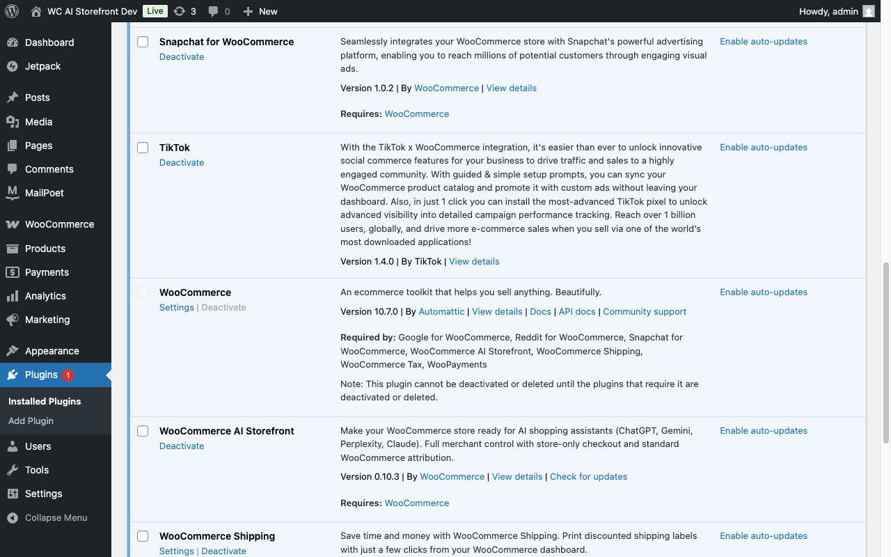

A new menu item appears under **WooCommerce → AI Storefront** in the sidebar.

---

## 3. Enable AI Storefront

The plugin installs in **paused** mode. Nothing publishes until you turn it on.

Go to **WooCommerce → AI Storefront**. The page opens with a hero screen showing the headline "List once. Sell everywhere AI shops.", four AI agent chips (ChatGPT, Gemini, Perplexity, Copilot), and the **Enable AI Storefront** button.

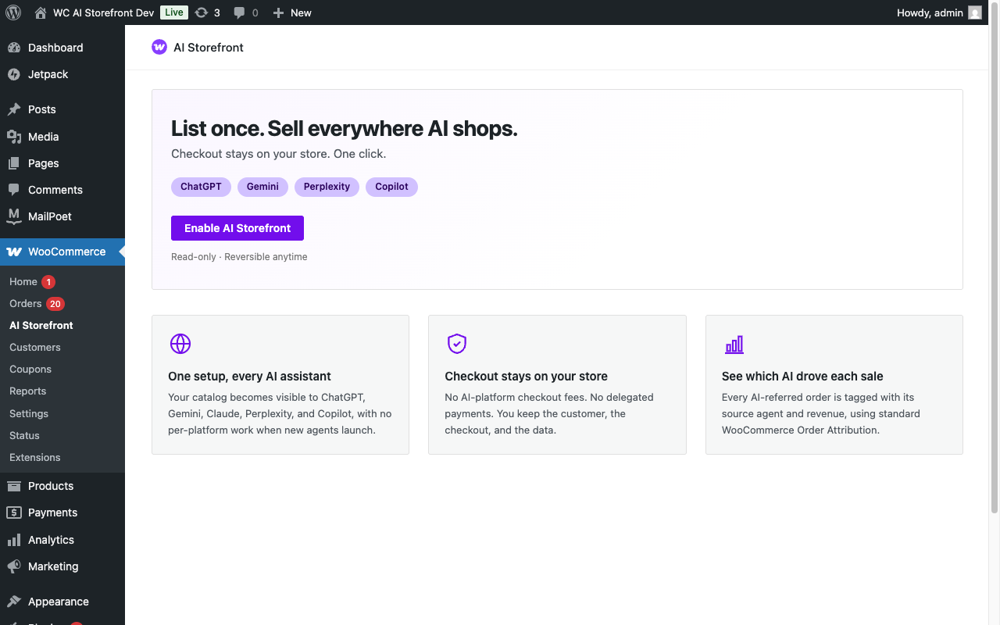

Click **Enable AI Storefront**. The hero is replaced by the section nav (Overview, Visibility, Policies, Discovery) and the plugin goes live.

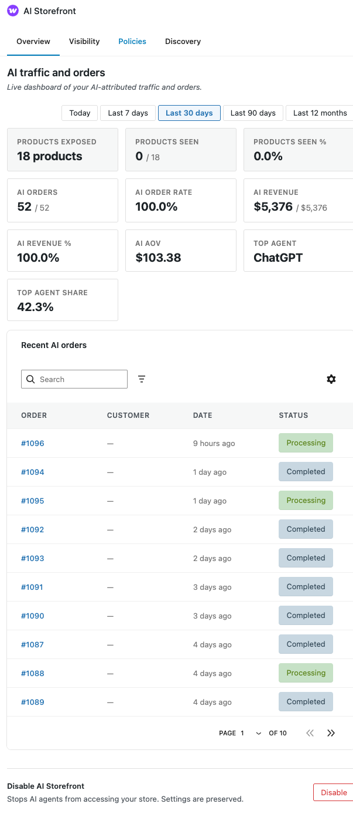

Enabling does five things:

- Tells AI crawlers where they're allowed to look on your store.
- Publishes a text guide of your store at `/llms.txt` (visible to AI agents).
- Publishes your store's business details at `/.well-known/ucp` (visible to AI agents).
- Adds product details (prices, return policies, etc.) in a format AI agents understand.
- Starts tracking which orders came from AI shopping assistants so you can see the results.

To pause, click **Disable AI Storefront** at the bottom of the page. AI agents will no longer be able to see your catalog endpoints, but existing order tracking remains in place.

The Overview tab populates with stat cards once data flows in:

- **Products exposed**: products AI agents can currently see (matches your visibility settings). Shown on a tinted background to distinguish a configuration value from the performance stats below.
- **Products seen**: how many of those exposed products an AI agent has actually requested in the period, shown as `N / M` where M is the total products exposed.
- **Products seen %**: what fraction of your exposed catalog AI agents have touched. Tells you reachability at a glance.
- **AI orders**: AI-attributed orders in the period, shown as `N / M` where M is your total store orders for context.
- **AI order rate**: percentage of all store orders that came from AI in the period.
- **AI revenue**: revenue from AI-referred orders, shown as `$X / $Y` where Y is total store revenue in the period.
- **AI revenue %**: AI revenue as a percentage of total store revenue.
- **AI AOV**: average order value across AI-referred orders. Tells you whether AI traffic shops big or small.
- **Top agent**: which AI agent drove the most orders (ChatGPT, Gemini, Perplexity, etc.).
- **Top agent share**: what fraction of your AI orders the top agent represents.
- **Agent / Referral**: how your AI orders split between two channels. **Agent** is shoppers an AI assistant walked through to checkout (a live shopping session). **Referral** is shoppers who clicked through after an AI search result, AI Overview, or chatbot citation mentioned your product. Shown as `X% / Y%` where X is Agent and Y is Referral. The split tells you whether AI is **selling** for you (Agent dominant) or **referring** for you (Referral dominant), which usually points to different growth investments. **Diagnostic use:** a near-zero Agent share when you're confident an agent like Gemini is sending traffic typically means the agent isn't discovering your UCP manifest, and is deep-linking from your Schema.org product markup instead. Re-check that `/.well-known/ucp` is reachable from outside your network (Layer 1 of the verification in §4).

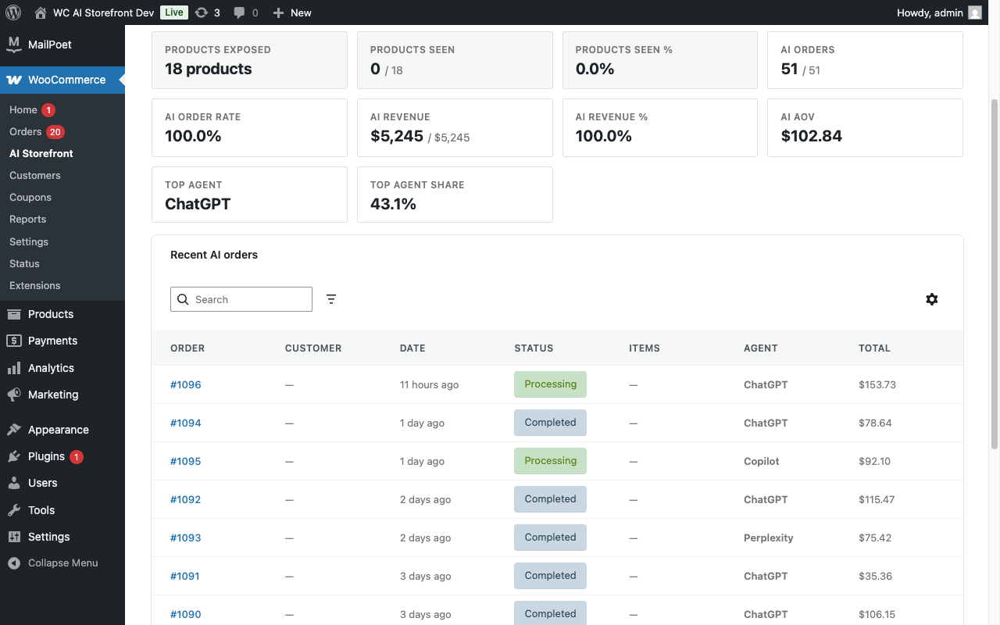

A date-range strip above the stat cards lets you pick the window: **Today**, **Last 7 days**, **Last 30 days**, **Last 90 days**, **Last 12 months**. Each is a trailing window from the moment you click; the labels match the underlying behavior (a "Last 12 months" click means the last 365 days, not the previous calendar year).

> Stats are blank on day one. First AI traffic typically lands within a few days; meaningful aggregate volume takes weeks.

---

## 4. Verify your discovery endpoints

Before configuring anything else, take 30 seconds to confirm the endpoints are live.

| URL | What you should see |
|-----|---------------------|
| `https://your-store.com/llms.txt` | A plain-text Markdown document starting with `# Your Store Name`, with sections covering store identity (`## Store`), browse/search URLs (`## Browse`), top categories (`## Catalog`), shipping and returns (`## Shipping & Returns`), structured-data signposts, and agent-facing endpoints (`## For agents`). |
| `https://your-store.com/.well-known/ucp` | A pretty-printed JSON document in monospace. Top-level keys: `name`, `version`, `capabilities`, `payment_handlers`, `services`. |
| `https://your-store.com/robots.txt` | The standard WordPress `robots.txt` plus a block of `User-agent: GPTBot` / `User-agent: ChatGPT-User` / etc. each with `Allow:` lines. |
| `https://your-store.com/opensearch.xml` | A small XML document starting with `<OpenSearchDescription>`. It tells AI agents and browsers how to search your products, pointing at both your product-search page and the catalog API. |
| Homepage → "View page source" | Search for `"@type":"OnlineStore"`. This is your store's brand info available to AI shopping agents. See [section 4b](#4b-what-the-homepage-publishes-to-ai-agents). |
| Any product page → "View page source" | Search for `"@type":"Product"`. You should see product details like prices and (once you set one in [section 7](#7-set-your-store-policies)) return policy information. |

The Discovery tab shows the same URLs as clickable links with reachability dots. URLs render in monospace font:

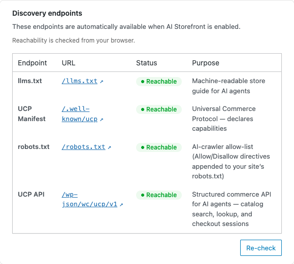

If something returns 404 or shows your homepage, jump to [Troubleshooting](#10-troubleshooting).

**Verify your setup in three layers, most reliable first.** AI engines are non-deterministic — a single chat query is not a reliable signal of whether your store is correctly published. Use layered verification to separate "is the plugin working" from "did the AI engine cooperate."

**Layer 1 — Direct endpoint check (deterministic).** Visit `/llms.txt` and `/.well-known/ucp` on your store in a browser. If they return your store identity and protocol manifest, the plugin is working server-side, regardless of how AI engines behave. This is the load-bearing check.

**Layer 2 — Independent validation tools (recommended).** Run your domain through [UCPPlayground](https://ucpplayground.com/) or [UCPChecker](https://ucpchecker.com/). They fetch your endpoints directly and report what they see, with no AI-side caching or fetch-versus-fabricate variability. See [section 4a](#4a-independent-validation-tools).

**Layer 3 — Live AI assistant query (variable results).** Ask an assistant with live web browsing:

> *"Find products at \[your-store.com\] that match \[some attribute, e.g. 'red running shoes under $100'\]."*

Expect different behavior across engines:

- **ChatGPT** typically fetches the URL when a domain is named in the prompt; usually returns real product names within seconds.
- **Gemini** sometimes fetches, sometimes doesn't. If it returns plausible-sounding products that aren't in your catalog, it's hallucinating from training data, not failing your setup. Ask `"Did you actually fetch [your-store.com]?"` to surface this.
- **Claude / Perplexity** behavior varies by which surface you use (chat versus answer engine).

If layers 1 and 2 succeed but layer 3 hallucinates or comes up empty, your store is correctly publishing. The AI engine hasn't fetched, or has cached an older fetch. Wait a few hours or try a different engine. Don't treat layer 3 alone as authoritative.

Natural-language search queries match against your product categories, tags, brands, and attributes, not just product titles. So an agent asking for "hoodies" will find products in your "Hoodies" category even if the individual product titles use a different word, and "watches" will find products in a "Watch" category. Plural and singular forms are handled automatically.

### 4a. Independent validation tools

The plugin's UI shows you what the plugin THINKS it's publishing. For an independent view of what an AI agent or the UCP protocol layer actually sees, three widely-used community tools can help. They're independent of Automattic and this plugin, but maintained by people active in the UCP ecosystem (UCPPlayground's creator sits on the UCP.DEV technical council).

| Tool | What it answers | When to use |
|---|---|---|
| **[UCPPlayground.com](https://ucpplayground.com/)** (Agent + Playground modes) | What does an AI shopping agent see when it walks your catalog and checkout? | End-to-end testing. Catches product-data issues (missing prices, unpurchasable variants, broken images) before real agents do. |
| **[UCPChecker](https://ucpchecker.com/)** | Is your UCP manifest and catalog spec-conformant? | Protocol validation. Catches shape drift after a plugin upgrade or after touching extension filters. |
| **[UCP Registry](https://ucpregistry.com/submit)** (optional) | A directory of UCP-enabled stores. How widely AI agents query it varies. | Submission costs nothing. Treat as opt-in rather than required. |

These tools are not officially affiliated with Automattic. URLs and capabilities may change over time. If any link is dead, the UCP spec page at https://ucp.dev/ will usually point at the current validator or playground.

### 4b. What the homepage publishes to AI agents

Your homepage now publishes your store's brand details (name, logo, address, contact) in a format that AI agents understand. AI shopping assistants use this info to confirm they're recommending the right store.

| Field | Source | Notes |
|-------|--------|-------|
| Store name, description, URL | WordPress Site Settings | Edit at **Settings → General**. |
| Currency | WooCommerce setting | Edit at **WooCommerce → Settings → General**. |
| Logo | Site logo or icon | Edit at **Appearance → Customize → Site Identity**. Used if set. |
| Address | Store location | Edit at **WooCommerce → Settings → General**. Shows city, state, zip, country only. |
| Email | Your WooCommerce email | See **Customer service email** below. |
| Search | Auto-generated | Lets AI agents search your store. Advertised on every page (not just the homepage) and via the `/opensearch.xml` descriptor, so agents can find your search no matter where they land. |
| Categories | Auto-generated | A summary of your main product types. |
| Return policy | Your plugin settings | Edit at **WooCommerce → Settings → AI Storefront → Policies**. See [section 7](#7-set-your-store-policies). Published only when you've set a policy other than "Not configured". |
| Specialties | Auto-generated | A short list of what your store specializes in, derived from your top product categories. |

**About the address.** Only your city, state, zip, and country are published to AI agents. Your street address is intentionally hidden for privacy and safety. If you use your home address for tax purposes, it stays private.

**Customer service email.** The plugin uses your WooCommerce email settings in this order:

1. **Reply-to address** at **WooCommerce → Settings → Emails → Sender options**, if enabled. This is your customer-contact email.
2. **From address** as a backup, unless it's a noreply address (the plugin skips those to avoid routing messages into black holes).

The plugin never publishes your WordPress admin email as a public contact. If neither address works, the email contact is omitted entirely.

**Phone and social profiles** are not published by this plugin. If you want to add them, other plugins (like Jetpack or Yoast) can help with that.

---

## 5. Choose which products to expose

The **Visibility** tab controls what AI agents can see. Three modes:

| Mode | What AI agents see | Use when |
|------|--------------------|----------|
| **All published products** | Everything currently published | Default. Use unless you have a reason to scope. |
| **Products by category, tag, or brand** | Only products in the selected taxonomies | You want to expose evergreen lines but exclude clearance, NSFW, or out-of-region products. |
| **Specific products only** | Only products you pick individually (with typeahead search) | Curated launches, B2B-restricted SKUs, limited drops. |

**Steps:**

1. Open the **Visibility** tab.
2. Pick the mode.
3. For **Products by category, tag, or brand**, switch between the **Categories**, **Tags**, and **Brands** sub-tabs and check what you want included. The **Brands** sub-tab only appears if your store has a `product_brand` taxonomy registered (typically via WooCommerce Brands or a similar plugin); without one, you'll see only Categories and Tags. Taxonomies with 20+ terms have a search bar. Checkboxes render in a 2-column grid. The product-count pill updates live.
4. For **Specific products only**, use the typeahead search box to find products by name or SKU. Click a match to add a chip; already-added items appear disabled with a checkmark. Chips show the product name and SKU.
5. Click **Save changes** at the bottom-right.

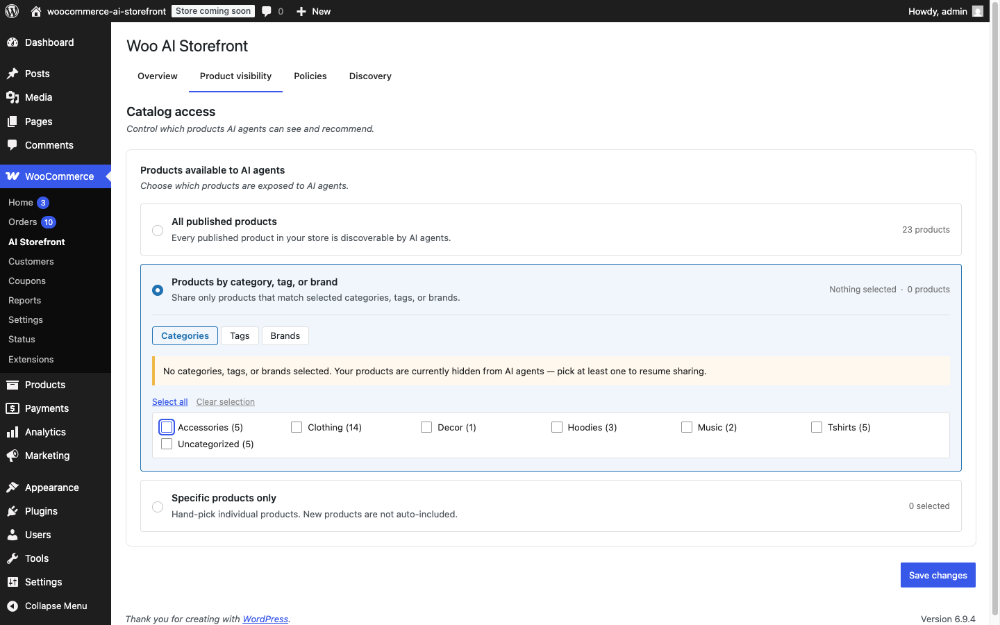

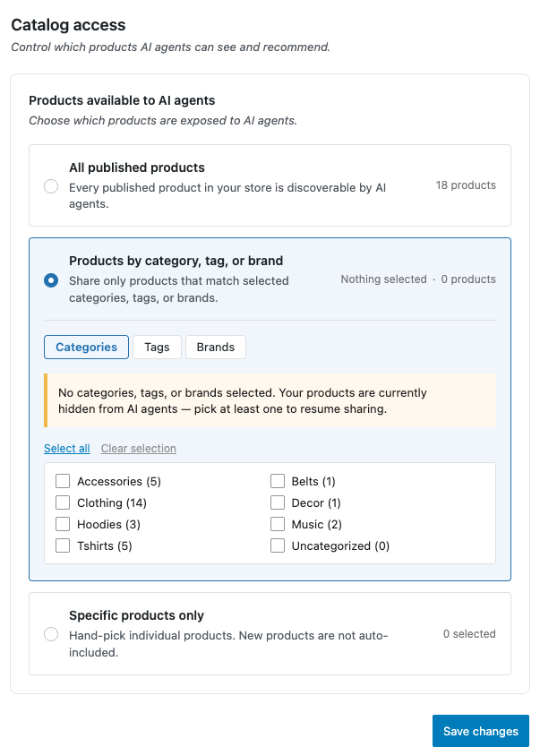

Visibility settings apply everywhere: your store guide, your catalog endpoints, and product details. Excluded products won't show up when AI agents search your catalog.

### Catalog access

The **Catalog access** card shows the total product count and the count exposed to AI agents. Visibility settings are enforced on the selection mode you choose.

> **Note.** Visibility settings only affect AI-agent-facing surfaces. The Shop page, search, and category archives keep working exactly as before for regular shoppers.

---

## 5b. Shape your catalog for AI discoverability

Beyond *which* products you expose, the *shape* of your product taxonomy is the single biggest lever for how well AI shopping agents and search engines understand your store. The plugin publishes whatever taxonomy you give WooCommerce: clean structure goes in, clean structure goes out.

This section is a pragmatic playbook. Allow 30–60 minutes for a small catalog (<50 products); a few hours for a larger one.

### Why category structure matters more than you'd think

When an AI agent answers *"where can I buy a heavyweight cotton tee?"*, it does three things in sequence:

1. **Retrieves** candidate products from indexed structured data on product pages and ingested feeds.
2. **Filters** by category, attributes, price, availability.
3. **Cites** specific stores back to the shopper.

Steps 2 and 3 lean heavily on category labels. If your tees sit in a category called *"Summer Vibes"*, an agent matching against *"tees"* may miss them entirely, or surface them with a confusing context line. If your tees sit in a category called *"Tops > Tees"*, an agent immediately knows what they are, what they're a subset of, and how to compare them to competing products.

The same goes for Google AI Overviews and Merchant Center: Google increasingly maps merchant categories onto its own **Google Product Taxonomy** (a public hierarchy of ~5,500 standardized product types). Categories that align cleanly with that taxonomy show up better in shopping surfaces. Categories that don't (marketing-driven names, audience-driven names, seasonal labels) are guessed at or skipped.

### Five principles for a strong catalog taxonomy

**1. Name categories for *what the product is*, not *who it's for* or *when it's sold*.**

| Less effective | More effective |
|---|---|
| Summer Vibes | Tees, Swimwear |
| Dad's Picks | Watches, Wallets |
| Best Sellers | (use a tag, not a category) |
| New Arrivals | (use a tag, not a category) |
| Holiday 2026 | (use a tag or product feature image, not a category) |

Marketing/seasonal/audience labels are useful for store navigation; keep them as **tags** or product attributes. They're a poor primary taxonomy because they tell an AI agent nothing about what the product is.

**2. Use a shallow hierarchy: 2 levels is usually enough.**

A two-level tree (parent → leaf) is enough for most small and mid-sized catalogs. Three levels is acceptable when a parent genuinely has many distinct subtypes (e.g. *Apparel > Tops > Tees*). Going deeper than that with one product per leaf does more harm than good: the navigation becomes brittle and the data sparse.

**3. Every product should sit in a *leaf*, not a *parent*.**

If you have `Accessories > Hats`, no product should be filed under bare `Accessories`. Parents are for navigation; leaves carry the taxonomy. A product directly assigned to `Accessories` is effectively saying *"this is an accessory, but we don't know what kind"*, which is exactly what you don't want AI agents to read.

**4. Align category names with Google Product Taxonomy where possible.**

Google publishes a free, public list at [google.com/basepages/producttype/taxonomy-with-ids.en-US.txt](https://www.google.com/basepages/producttype/taxonomy-with-ids.en-US.txt). It's the canonical reference for shopping surfaces (Google Merchant Center, Google AI Overviews, Gemini shopping, and many AI shopping agents that piggyback on Google's structure).

You don't need to *be* Google's taxonomy. Most stores use their own names for branding reasons. But you do want your categories to **map cleanly** to Google nodes. A few wins from matching Google's terminology where it's unobtrusive:

| Your category | Closer to Google's path | GPT ID |
|---|---|---|
| `Hoodies` | `Hoodies & Sweatshirts` | 5697 |
| `Coats`, `Jackets` (separate) | `Coats & Jackets` (one) | 5598 |
| `Sunglasses` | `Sunglasses` (under Eyewear) | 178 |
| `Notebooks` | `Notebooks & Notepads` | 2419 |

Pragmatically: pick names a shopper would recognize, and where Google's name is also recognizable, use Google's. Where Google's name is awkward (`"Apparel & Accessories > Clothing > Shirts & Tops"`), use your own and just keep it short and unambiguous.

**5. Tell Google what you mean: set Google Product Category per category.**

If you have an SEO or product-feed plugin installed (Yoast SEO, RankMath, Google Listings & Ads, Facebook for WooCommerce), it likely exposes a *"Google Product Category"* field on each product category. Setting it once per category lets every product inside inherit the correct mapping, and lets Google Merchant Center and shopping agents read your catalog without guessing. AI Storefront does not surface this field itself today, but the moment any of those plugins set it, the data is on the term where future AI Storefront versions can read it.

### A worked example: before and after

Here is the shape of a small apparel store before and after a 30-minute reshape. The before column is what merchants commonly end up with after a year of organic growth; the after column is a clean two-level hierarchy that maps cleanly to Google Product Taxonomy.

**Before (organic growth):**

```
- Tees           (10 products)  → "tees", fine
- Shirts         (4 products)   → "shirts", fine
- Hoodies        (5 products)   → "hoodies", close to Google's "Hoodies & Sweatshirts"
- Knits          (1 product)    → too few products to justify own category
- Outerwear      (3 products)   → mix of jackets and BOOTS; boots aren't outerwear
- Accessories    (13 products)  → bucket of hats, bags, sunglasses, socks, belts,
                                  a notebook, AND a gift card; nothing in common
- Capsule        (4 products)   → subscription drop; merchandising, not taxonomy
- Jackets        (0 products)   → aspirational, empty
- Bottoms        (0 products)   → aspirational, empty
```

**After (30 minutes of reshape):**

```
- Tops                                     (parent, 0 products, for navigation only)
  - Tees                                   (10 products)
  - Shirts                                 (4 products)
  - Knits                                  (1 product)
- Activewear                               (parent)
  - Hoodies & Sweatshirts                  (5 products)        → matches Google name
- Outerwear                                (parent)
  - Coats & Jackets                        (1 product)         → matches Google name
- Footwear                                 (parent)
  - Boots                                  (2 products)        → moved out of Outerwear
- Accessories                              (parent)
  - Hats                                   (4 products)
  - Bags                                   (1 product)
  - Eyewear                                (1 product)
  - Belts                                  (1 product)
  - Socks                                  (1 product)
  - Neckwear                               (2 products)
  - Stationery                             (1 product)         → notebook lives here,
                                                                 not under apparel
- Gift Cards                               (1 product)         → top-level, not under
                                                                 Accessories
- Capsule                                  (4 subscription products) ← kept as a
                                                                       merchandising
                                                                       category
```

Same products, same store, twenty minutes of work, and the resulting JSON-LD now carries category labels every AI agent and search engine recognizes. The `Bottoms` and empty `Jackets` were deleted; the bucket `Accessories` was preserved as a navigational parent but every product was moved to a real leaf inside it.

### How to execute a reshape in WP-Admin

Step-by-step, from the WooCommerce admin:

1. **Audit what you have.** Open *Products → Categories*. Note the product count next to each. Empty or near-empty categories are candidates for deletion or merging. Categories with mixed product types (e.g. *"Accessories"* containing both apparel items and gift cards) are candidates for splitting.

2. **Sketch the target tree** on paper or in a doc. Two levels max. Each leaf should have at least 2–3 products, ideally more. If a category has 1 product and isn't growing, fold it into its parent.

3. **Create new categories before reassigning products.** From *Products → Categories*: add the new parents first, then the new leaves with the parent set. This way, when you reassign products, the destination already exists.

4. **Reassign products in bulk.** From *Products → All Products*: use the *Filter by category* dropdown to find products in the old category, then bulk-edit their *Categories* field to move them. WooCommerce supports multi-category assignment; if a product genuinely belongs in two leaves (e.g. a hoodie that's also part of a kit), assign both.

5. **Reassign one of each variation product.** Variable products and grouped products keep their existing category assignment when you reassign; no special steps needed.

6. **Delete old or now-empty categories last.** Reassigning all products out of a category drops its count to 0; you can then delete it from *Products → Categories* without losing anything.

7. **Set Google Product Category per category** (if you have an SEO/feed plugin that supports it). Edit each category, find the *Google Product Category* dropdown, and select the closest Google node.

8. **Verify the result.** Visit a product page, view source, and find the `<script type="application/ld+json">` block. The `Product.category` field should now show your new leaf name. The breadcrumb block should show the full path.

### What about category names that don't map to any Google node?

Some categories are genuinely **merchandising**, not taxonomic: *"Capsule"* (subscription drops), *"Limited Edition"*, *"Collab"*. These don't have a clean Google taxonomy equivalent and that's fine. Two options:

1. **Keep them as categories** and also assign each product to a physical-product leaf (e.g. a hoodie in the *Capsule* drop is also assigned to *Activewear > Hoodies & Sweatshirts*). AI Storefront picks the deepest leaf in the longest path when emitting `Product.category`, so the physical leaf wins, and the merchandising category remains for browse navigation.

2. **Convert them to tags.** Use *Products → Tags* to add a `capsule` tag, retag the products, and remove the category. Tags don't appear in JSON-LD `Product.category` so they don't pollute the canonical category.

Pick whichever preserves the navigation your shoppers expect. Either way, the AI-facing category stays clean.

> **Note on category-name search**: AI Storefront does light synonym handling in agent search (singular/plural, common variants). It doesn't translate marketing names into product types. If your `Summer Vibes` category contains swimwear and an agent asks for swimwear, the agent will not find it unless the category is renamed *or* you also assign those products to a `Swimwear` category.

### Optional: let an AI assistant help you with the reshape

WooCommerce **core** ships a built-in MCP (Model Context Protocol) integration starting in WC 10.3.0, designed for **admin-side** AI: it lets AI assistants like Claude or ChatGPT, running under your own credentials, read and modify your store on your behalf from inside the admin. There is no extension to install: the integration is already on your store after you update WooCommerce, gated behind a feature flag you toggle on.

WooCommerce's MCP is a developer-preview feature, enabled per store. Once on, an MCP-aware assistant gets access to WooCommerce's product and order operations, including the ability to read your current `product_cat` taxonomy, propose a reshape against the principles above, and apply the changes after you approve.

This is genuinely useful for the kind of work this section describes: large catalogs (hundreds of categories), legacy stores with organic-growth taxonomies, or merchants who want a second opinion on which categories are taxonomic vs. merchandising.

**Two important notes before enabling:**

1. The feature is in *developer preview*. WooCommerce may change behaviors and APIs between releases. Treat it accordingly: enable on a staging copy first if you can.
2. An MCP-connected assistant can read and modify your store. Use a WooCommerce REST API key scoped to least privilege (a *Read/Write* key is enough for catalog work; you don't need to expose orders or customers if you're only reshaping categories). Revoke the key when you're done.

**To enable it on your store:**

1. Follow WooCommerce's official guide: [Model Context Protocol (MCP) Integration](https://github.com/woocommerce/woocommerce/blob/trunk/docs/features/mcp/README.md). It covers enabling the `mcp_integration` feature flag, generating an API key, and connecting clients like Claude Code.
2. Once enabled, point your AI assistant at this section of the User Guide as context, and ask it to audit your current `product_cat` taxonomy and propose changes.
3. Review and approve each batch of changes before they're applied.

If your store is **not** on a host that supports the MCP setup, you can still apply the principles in this section manually via *Products → Categories* in WP-Admin, or scriptedly via [WP-CLI](https://developer.wordpress.org/cli/commands/wc/) (`wp wc product_cat ...`) or the [WooCommerce REST API](https://woocommerce.github.io/woocommerce-rest-api-docs/) with an [Application Password](https://make.wordpress.org/core/2020/11/05/application-passwords-integration-guide/).

> **AI Storefront does not register its own MCP abilities yet.** What WooCommerce's MCP exposes today (products, orders, and the WC Abilities API surface) is enough to do the catalog-shaping work in this section. AI Storefront-specific admin abilities (JSON-LD validation, taxonomy mapping audits, syndication-state queries) are on the plugin's roadmap and will become available once the WooCommerce MCP integration leaves developer preview. None of those would change what external shopping agents see; they'd only give your own AI assistants better tools for grooming the store.

---

## 6. Configure crawlers and rate limits

The **Discovery** tab controls which AI crawlers can read your endpoints and how aggressively. All form input fields on this tab are 32px tall.


### AI agent access

The crawler list groups 18+ AI bots into three collapsible sections, each with a count badge and chevron:

- **Live browsing agents**: fetch pages in real time when a user asks. Default: **on**. These drive shopping clicks.
- **Training crawlers**: feed AI providers' training corpora. Default: **on**. Letting your catalog inform model updates is generally good for long-tail product discovery.
- **Test/validation crawlers**: for protocol-compliance tools like UCPPlayground. Default: **off**.

Unchecking tells that crawler to stop. Most legitimate AI crawlers will respect this; malicious bots typically ignore it anyway.

A toggle labeled **Other AI agents** controls whether unlisted crawlers can access your store. When checked, AI agents whose brand isn't in the list can access your store.

### Shopify-compatible product feed

A toggle labeled **Serve a Shopify-compatible /products.json catalog feed** controls whether your store answers requests at `/products.json` (and the `/collections/all/products.json` alias). The same toggle also serves the scoped paths assistants drill into next: a single product at `/products/{handle}.json`, one category's products at `/collections/{handle}/products.json`, and your category list at `/collections.json`. It is **on by default**.

Here is why it helps. Many AI shopping assistants learned to read catalogs from Shopify stores, which publish their products as JSON at `/products.json`. When one of these assistants meets a store it doesn't recognize, the first thing it often tries is that same address. If your store answers in the format it expects, the assistant can read your whole catalog in one request and start recommending your products right away. If your store returns nothing, the assistant may move on.

This feed publishes the same products you already expose to AI agents (it respects your Visibility settings exactly like every other surface), just in the shape these assistants are trained to read: product titles, descriptions, prices, variants, images, and stock status. Nothing new is exposed. The same product data is already public on your storefront and through your other discovery endpoints; this is one more door into it, shaped for a common type of shopping assistant.

Leave it on unless you have a specific reason not to publish a bulk catalog file. You might switch it off if you prefer AI assistants to discover products one at a time through search rather than pulling your entire catalog at once. Turning it off makes `/products.json` return "not found"; it does not affect any of your other endpoints, your UCP manifest, or your product-page structured data.

### Rate limits

A 2 × 2 card grid shows four preset options: **Recommended** (25 per minute), **Conservative** (10 per minute), **Generous** (100 per minute), and **Custom**. Select one to set how many times per minute each AI crawler can look up your products before being temporarily blocked.

Selecting **Custom** reveals an input box directly below where you can set your own limit.

Rate limiting only affects AI crawlers. Your regular shoppers and store experience are unaffected.

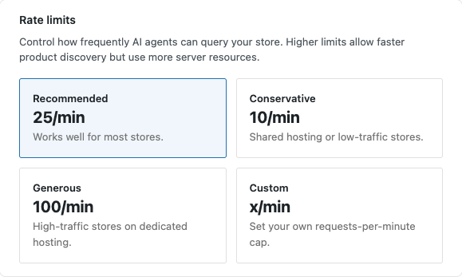

### AI activity log

The Discovery tab shows what AI crawlers are actually doing on your store. The plugin records every AI request to your catalog endpoints in a private log on your own server. Nothing leaves your site.

The period selector at the top (Day / Week / Month / Quarter) drives all three cards:

- **Top searches.** The most common product searches AI agents have asked for. If you see "running shoes" but don't sell shoes, the AI may be sending you the wrong shoppers. If you see "hoodies" and sell them but don't see many impressions, check that your category name matches what customers search for.
- **Products seen.** A sampled list of products that have been returned to AI agents in the period, with the count of how many times each was surfaced.
- **Per-agent breakdown.** Total requests grouped by AI brand (ChatGPT, Perplexity, Gemini, etc.). Useful for noticing when a new crawler starts visiting your store.

Data starts populating automatically once you enable the plugin. Detailed event logs are kept for 30 days; summary counts are kept for 90 days. Use this log to spot trends and problems, not as permanent storage.

Stats update hourly, so today's AI traffic appears in the dashboard within an hour of occurring.

### Revisit cadence

- **Quarterly.** New AI crawlers come online; check the list. Plugin updates sync the canonical roster; stale opt-outs stay opt-out.
- **After traffic spikes.** Lower the rate limit before you remove crawlers. Most spikes are first-time discovery; rates settle within a week.

---

## 7. Set your store policies

The **Policies** tab publishes structured signals that AI agents read when deciding what to show shoppers: return terms, shipping timelines, and more. Two cards are currently available.

Your return policy publishes in two places: on each product page (so an AI agent recommending one of your products can mention the policy), AND on your homepage (so an agent that discovers your store before a specific product can learn the store-wide commitment up-front). Per-product overrides (see below) only affect the per-product copy.

### Return & refund policy

When AI agents recommend your products, they often tell customers about your return window ("Free returns for 30 days"). This section controls what they say.

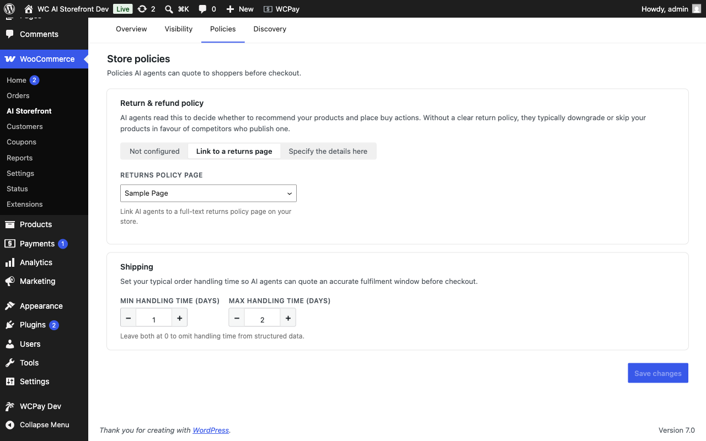

Three modes:

- **Not configured** *(default)*. AI agents won't mention a return policy. Use when your policy is complex and you'd rather AI agents link to your dedicated returns page.
- **Returns accepted.** Tell AI agents how many days customers have to return items, who pays for shipping, and what methods you accept.
- **Final sale.** Tell AI agents that items cannot be returned.

You can also link to an existing returns/refunds page from the dropdown. This is useful when the policy already lives on a customer-facing page.

#### Per-product overrides

Some merchants have a generally returnable catalog with specific final-sale items (clearance, custom, perishable). The **AI: Final sale** checkbox in the product editor's Inventory tab overrides the store-wide policy for that single product.

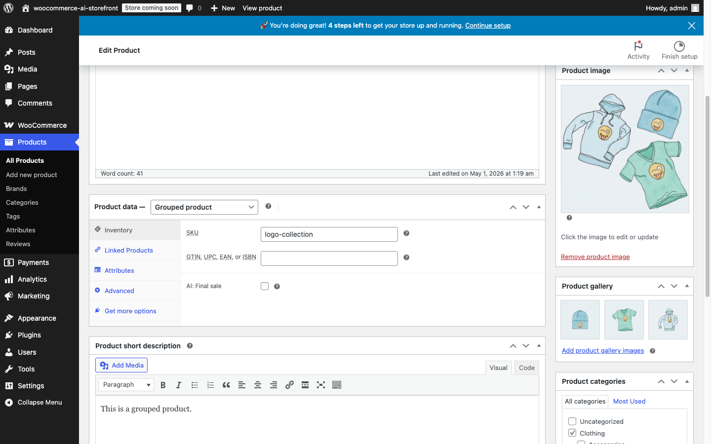

### Shipping: handling time

AI agents often tell shoppers "Ships in 1–2 business days" when recommending your products. This section lets you specify your actual handling time.

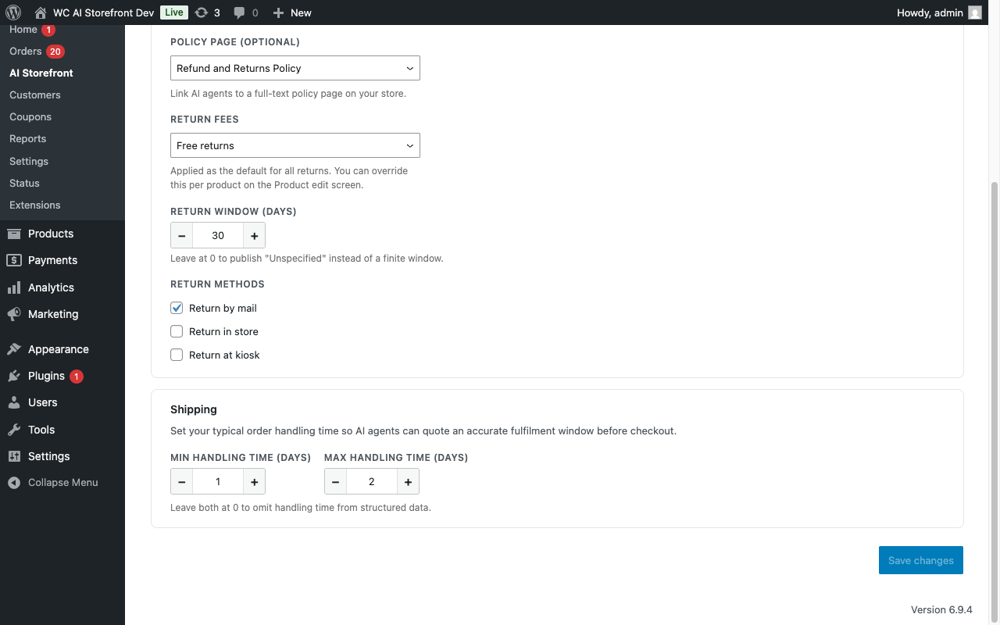

Set **Minimum** and **Maximum** business days using the number inputs. This is how long you need to pack and ship an order.

- Leave both at **0** (default) to skip this info.
- If you set max below min, it automatically adjusts to match min.
- A live preview below shows what AI agents will see.

> **Note:** Handling time is how long you need to pack and ship. Transit time (carrier and destination) is not included here.

---

## 8. Read attribution stats

When a shopper finds your store through an AI assistant and makes a purchase, WooCommerce automatically records:

- Which AI agent sent them (ChatGPT, Gemini, etc.).
- A session ID to track the interaction (not personally identifying).

### Reachability check

The Discovery tab shows a reachability indicator in the card intro. The note "Reachability is checked from your browser" confirms the endpoints are accessible to AI agents.

### Where to see it

**WooCommerce Orders list.** Open **WooCommerce → Orders**. The **Origin** column shows which AI agent sent the customer (ChatGPT, Gemini, etc.). Non-AI orders show `Direct`, `Unknown`, or the standard source.

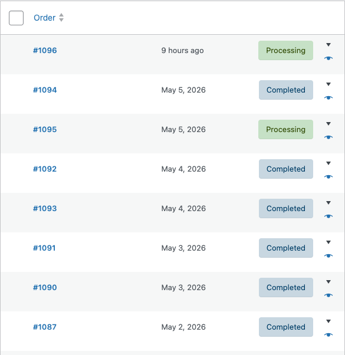

**Overview tab.** The stat cards aggregate AI orders, revenue, AOV, and top-agent share for the selected period.

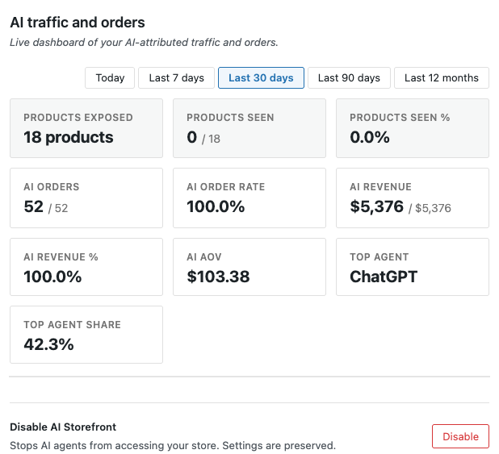

**Recent AI Orders table** (Overview tab). Shows your latest orders from AI referrals: order number, customer, date, status, items, which agent sent them, and total. Click an order number to see full details. Click a customer name to see all their orders. You can filter by agent or status, search, sort columns, and adjust the table view. Your table preferences are saved.

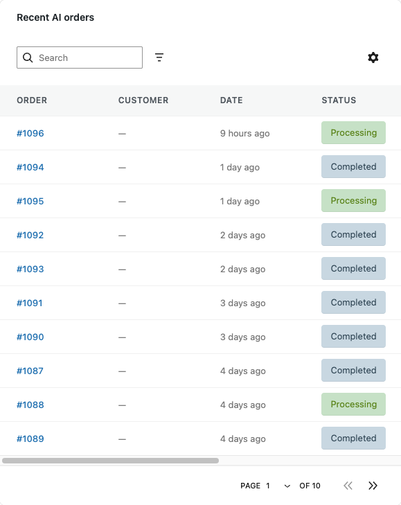

### What attribution doesn't capture

The plugin does not record:

- The customer's conversation with the AI agent (only that they came from one).
- Cross-device or cross-session journeys (only the final click).

If you want deeper multi-touch attribution, use an analytics tool that reads WooCommerce's order data.

---

## 9. Maintenance and monitoring

Day-to-day maintenance is minimal.

**Weekly (5 min).** Glance at the Overview tab. Sudden drops in AI orders usually mean an agent revised its crawl policy or `robots.txt` changed. If one agent dominates, dig into how that agent surfaces your products.

**Monthly (10 min).** Re-verify the four endpoint URLs from [section 4](#4-verify-your-discovery-endpoints). Security plugins or CDN changes can sometimes block them. Review your visibility scope too.

**After major changes.** Re-verify endpoints after a WordPress core update, a WooCommerce major version update, switching themes, installing or updating a security plugin (some block `/.well-known/` by default; allow-list `/.well-known/ucp` if so), or migrating hosts.

**Plugin updates.** AI Storefront updates often as the AI discovery protocol evolves. Check the CHANGELOG before updating. Version 0.x updates are backwards-compatible with your settings; a version 1.0 bump will include a migration guide.

---

## 10. Troubleshooting

### `/llms.txt` (or `/opensearch.xml`) returns 404

Permalinks need flushing. Go to **Settings → Permalinks** and click **Save Changes** (don't change anything, just save). Then reload the URL. If still 404, check the plugin is enabled (it must be active, not paused). Both endpoints are served by the same rewrite-rule mechanism, so the same fix applies to either.

### `/.well-known/ucp` returns 404 but `/llms.txt` works

A security plugin is blocking `/.well-known/`. Add `/.well-known/ucp` to its allow list.

### JSON-LD doesn't include the BuyAction

Your theme or page builder may be overriding WooCommerce's product details. Try switching to the Storefront theme temporarily to confirm. If that works, contact your theme developer or try a different theme.

### AI agents say they can't find your store

Check these in order:

1. Wait 24–48 hours (AI crawlers take time to discover new stores).
2. Look at the Discovery tab to see if any crawlers are allowed and working.
3. Check that your store's public URL in **Settings → General** matches the address you're testing from.
4. Visit `/llms.txt` from a fresh browser session to confirm it's live.

### `/llms.txt` doesn't list a sitemap

If your site only recently started publishing a sitemap (a fresh WordPress install, or you just enabled an SEO plugin that emits one), `/llms.txt` caches the "no sitemap found" result for 24 hours so it doesn't re-probe the same paths on every request. To force a refresh now, open **WooCommerce → AI Storefront**, change any setting and save (or save without changing anything on the Visibility / Discovery / Policies tab — the save itself busts the sitemap cache). The next `/llms.txt` fetch re-probes and picks up the sitemap.

### Stats are zero after a week

Check:

1. The Overview tab shows "Products exposed" > 0.
2. At least one live-browsing crawler is enabled on the Discovery tab.
3. The four URLs from [section 4](#4-verify-your-discovery-endpoints) all work.

If all are okay, AI traffic may still be building. AI agents cache your catalog, so it can take a week or more for real orders to appear.

### Orders show up as AI-attributed when they shouldn't

A team member tested with a real AI assistant and clicked through. The attribution is correct: that order really was AI-referred. Use a dedicated test account or staff discounts when smoke-testing.

### `robots.txt` looks empty after disabling

That's normal. The plugin removes its own instructions; what's left is just WordPress's standard settings (blocking the admin area).

---

## 11. Where to get help

- **Documentation index:** [`docs/README.md`](../README.md)
- **Engineering docs** (for developers extending or debugging): [`docs/engineering/`](../engineering/)
- **Bug reports & feature requests:** open an issue on GitHub.
- **Security issues:** see [`SECURITY.md`](../../SECURITY.md). **Do not** open a public issue for security reports.
- **General WooCommerce support:** [woocommerce.com/support](https://woocommerce.com/support/) for questions about checkout, payments, taxes, shipping, or anything else WooCommerce-core-shaped.

---

*Covers AI Storefront {{VERSION}}. Screenshots are approximate; your store may look slightly different depending on theme and admin color scheme.*
